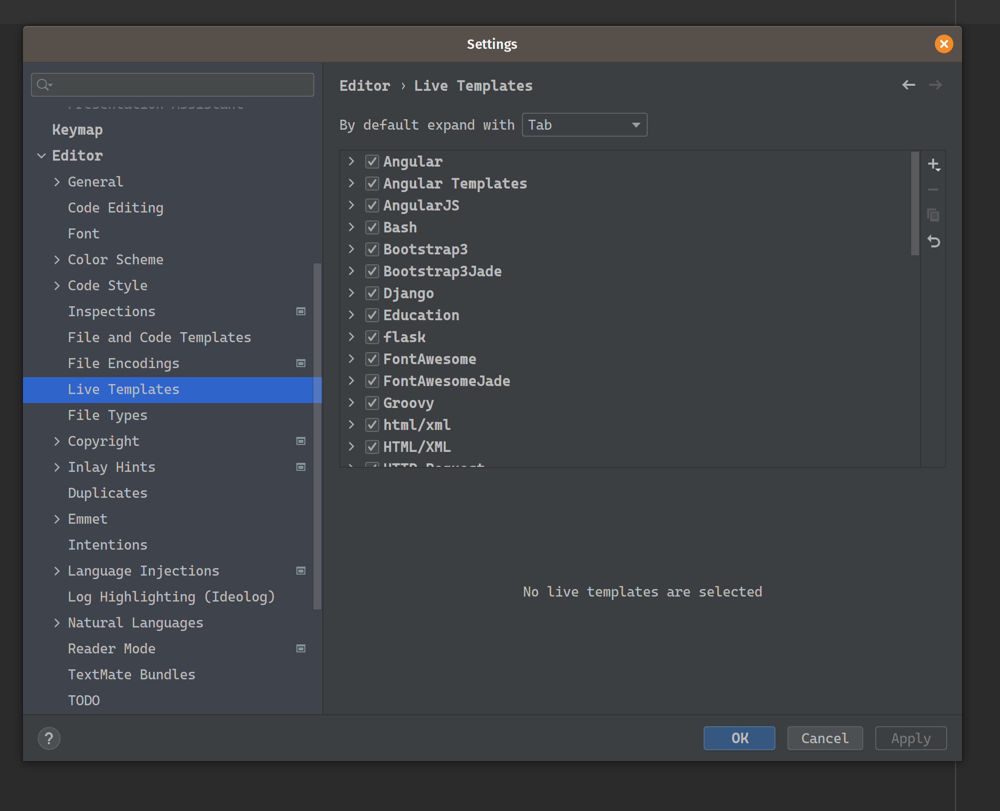
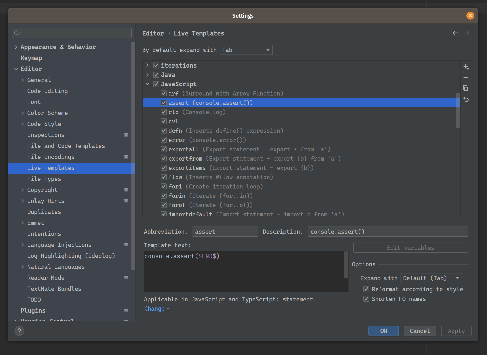
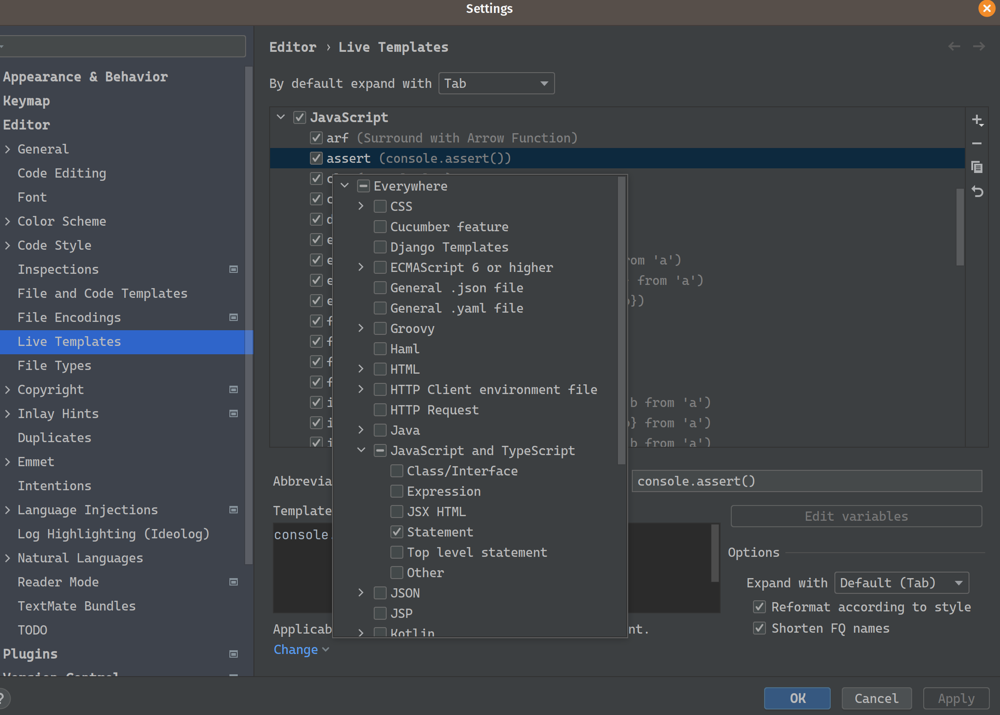
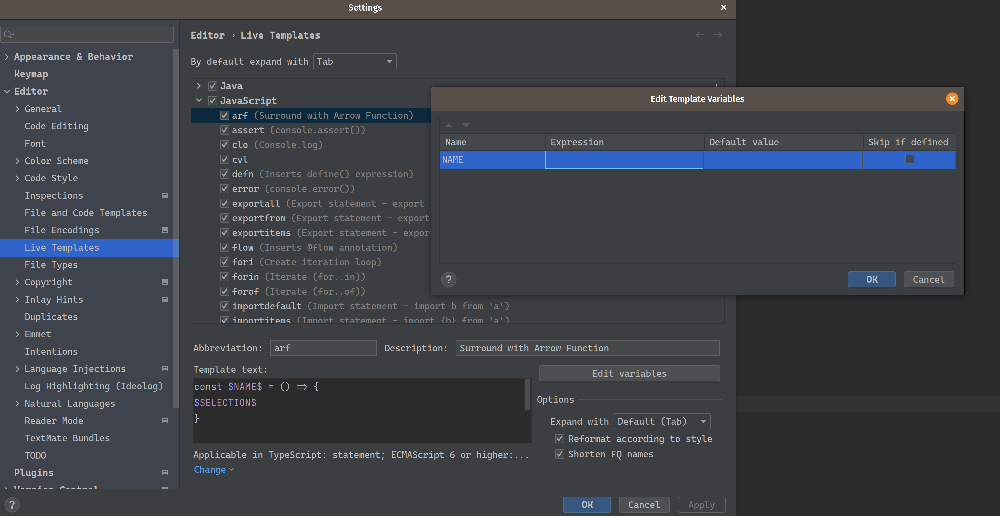
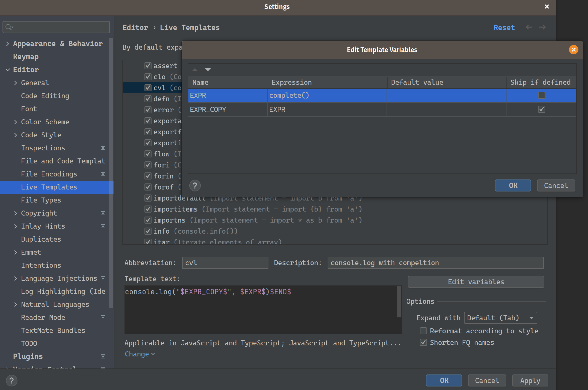
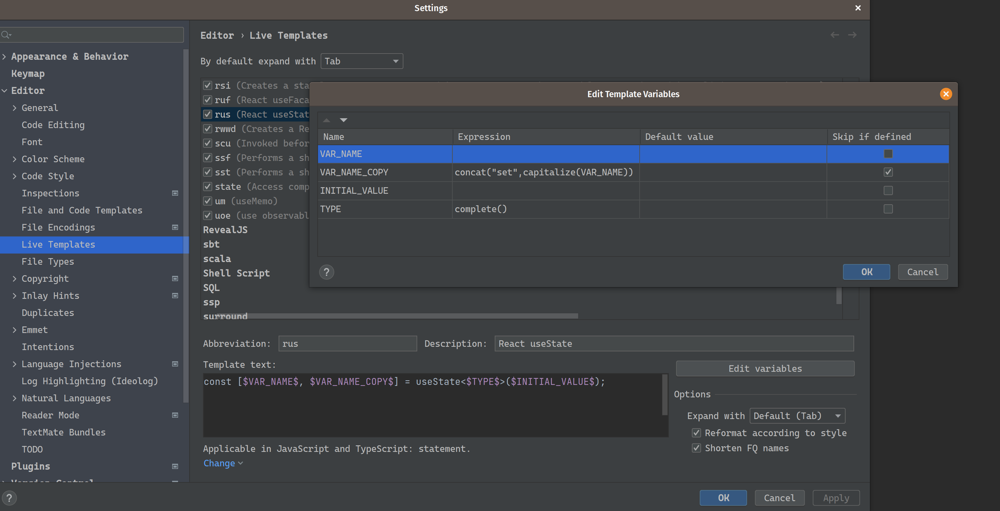
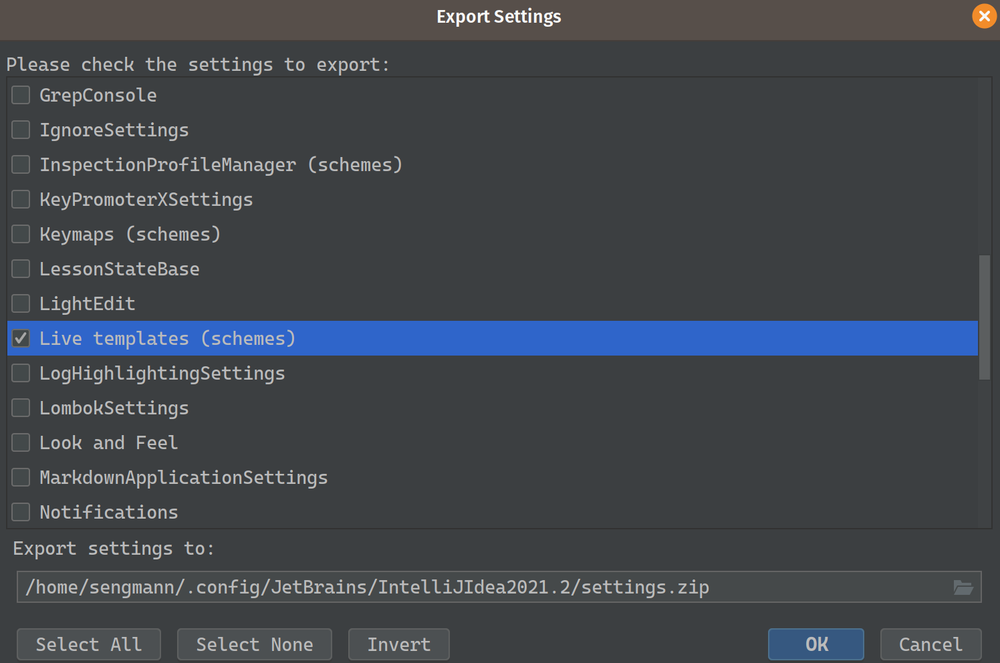
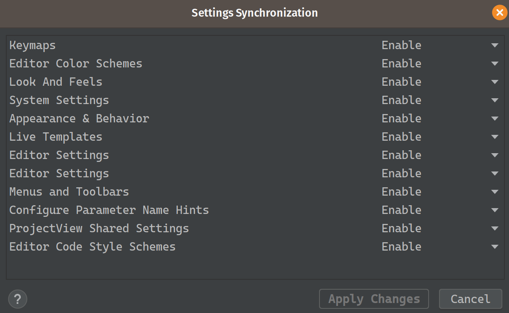

# Live Templates in IntelliJ

- [Live Templates in IntelliJ](#live-templates-in-intellij)
  - [Grundlagen](#grundlagen)
  - [Templates Import/Export](#templates-importexport)
  - [Fragen und eure Ideen](#fragen-und-eure-ideen)
  - [Danke](#danke)

Praktische kleine und große Helfer, wenn es darum geht sich weniger oft zu wiederholen.

## Grundlagen

Zu finden sind die Live Templates in den Einstellungen erreichbar über `File -> Settings -> Editor -> Live Templates`.

Zu sehen sind die verschiedenen Gruppen der Templates. Sobald wir eine davon aufklappen und einen Eintrag ausgewählt
haben, können wir dieses bearbeiten. Das Hinzufügen kann per Klick auf den Plus Button ausgeführt werden.

In der Editor-Box ist der Text, der bei der Ausführung eingesetzt wird zu sehen. Es gibt die Möglichkeit Variablen zu
definieren, in dem der Name zwischen `$` gesetzt wird. Dabei sind zwei immer vordefiniert.

<dl>
    <dt>$END$</dt><dd>Position des Cursors nach dem Ausführen des Templates</dd>
    <dt>$SELECTION$</dt>
    <dd>
        Wird die Funktion <code>surround with</code> verwendet befindet sich der ausgewählte 
        Text innerhalb der Variable
   </dd>
</dl>

Die Abbreviation wird zur innerhalb des Code-Editors genutzt, um das Template auszuführen. Zur weiteren Beschreibung 
dient das Feld Description. Eine zusätzlich wichtige Funktion ist die Einschränkung des Templates auf einen 
bestimmten Kontext. Mit einem Klick auf das Wort `Change` kann dieser ausgewählt werden. In der Auswahl wird die 
Sprache und die möglichen Scopes angegeben.

Werden eigene Variablen deklariert, wird die Schaltfläche `Edit varaibles` aktiv. Hinter dieser verbirgt sich ein 
Dialog, mit dem sie konfiguriert werden können.

Es ist möglich beim Einfügen des Templates mit der Tab-Taste zur nächsten Variable zu springen. Die Reihenfolge 
bestimmt sich durch die Liste, von oben nach unten. Mit dem Feld `Expression` kann ein Ausdruck angegeben werden, um 
den Inhalt der Variable zu errechnen. Dazu stehen viele vorgefertigte Funktionen zur Verfügung. Möglich ist es auch 
eine andere Variable zu referenzieren.

Der `Default value` erklärt sich praktisch selbst. Wird kein Wert durch die Expression ermittelt, wird der `Default 
value` stattdessen verwendet.

Die letzte Option kann genutzt werden, um zu entscheiden, ob die Variable beim Wechsel mit Tab noch angesprungen 
wird oder nicht.

Ein Beispiel für ein besseres `console.log` Template (Danke Roman)

Ein anderes Beispiel ist ein Template für den React Hook `useState`

## Templates Import/Export
Zum Import oder Export im Menü auf `File -> Manage IDE Settings -> Export Setttings` klicken und die Live Templates 
auswählen.

Für den Eigenbedarf kann auch die Synchronisierung per Jetbrains Account eingeschaltet werden. Damit sollten die 
Templates auch nach einem Wechsel zwischen Rechnern oder auch den Major Versions ohne Import der vorherigen Settings 
weiter zur Verfügung stehen. Kontrolliert, ob ein entsprechendes `Enabled` in den Einstellungen `File -> Manage IDE 
Settings -> IDE Settings Sync -> Choose Settings to Sync ` vorhanden ist.

## Fragen und eure Ideen

## Danke
